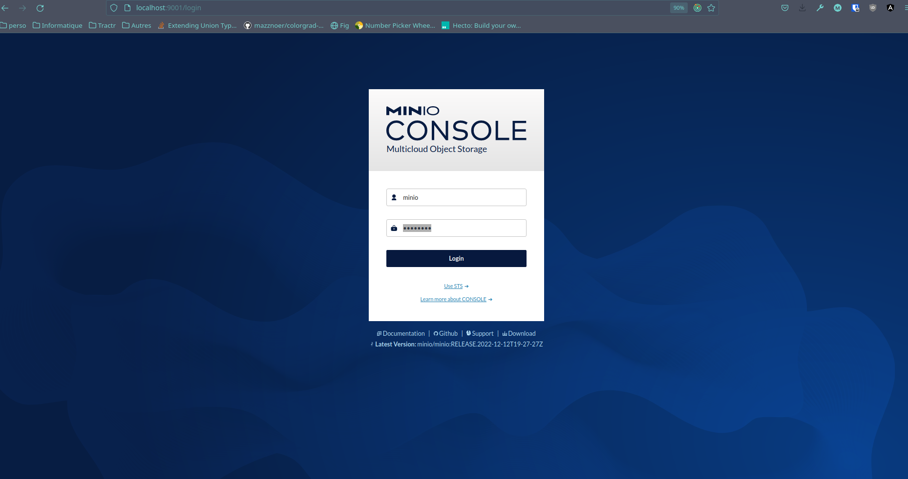
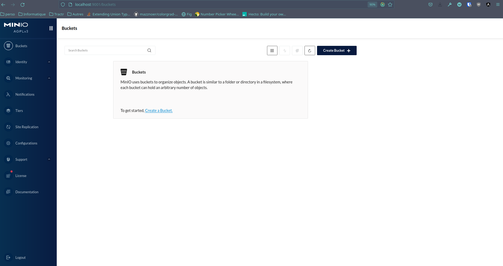
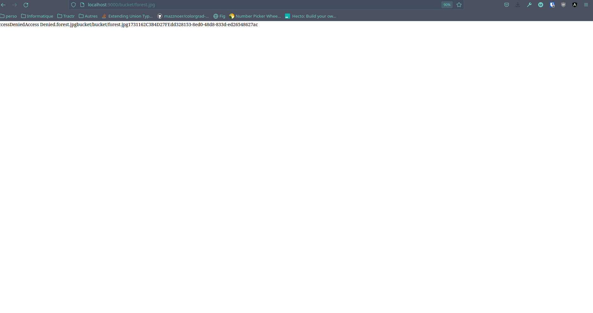
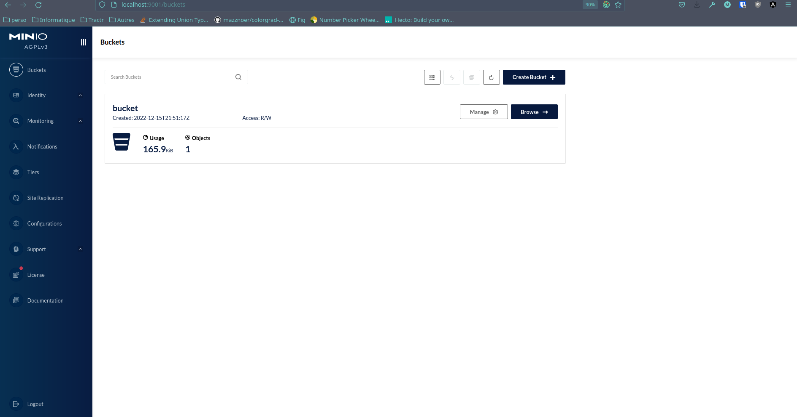
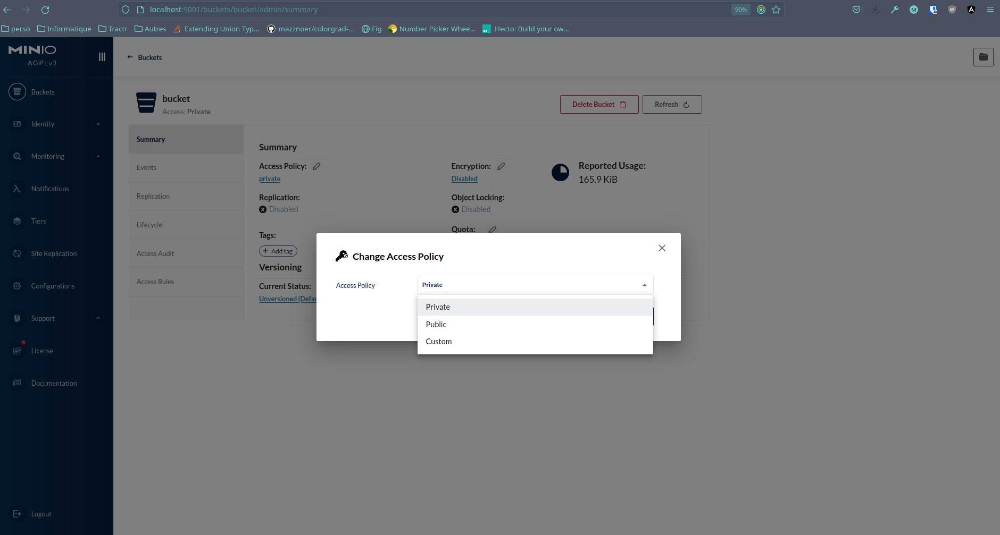

## Why use Minio in development

When developing an application that requires file storage, we typically rely on the AWS S3 service which provides a cloud-based solution to host a file storage service for storage and production environments.

However, this is not a viable solution for development, as it would require creating an AWS S3 bucket, which would not be convenient.

A better solution is to use [Minio](https://min.io/), which is an S3 compatible file storage software.

Usually, we use `docker-compose` to run third-party software that is needed in a development environment (databases, message brokers, stores...). Minio provides an [official docker image](https://hub.docker.com/r/minio/minio) on docker-hub.

## Add a Minio service to the existing `docker-compose.yml`.

To add Minio to an existing `docker-compose.yml` file, simply edit the file to create a new service and associated volume:

```yaml
version: '3'

services:
  # ..............

  # ADD THE FILE STORAGE SERVICE
  #------------------------------------------------
  # File storage
  #------------------------------------------------
  minio:
    image: minio/minio
    # '--console-address' param starts a web console which is useful to manage the store in development
    command: server /data --console-address:9001
    ports:
      # Bind the minio serviec to port 9000. It can be accessed to http://localhost:900
      - "${FILE_STORAGE_PORT:-9000}:9000"
      # Bind the web console to port 9001. It can be accessed at http://localhost:9001
      - "9001:9001"
    environment:
      # Environment variable are used to pass credentials to initialize a root user
      # Those variables should be defined in a '.env' file at the root of the repo
      MINIO_ROOT_USER: ${FILE_STORAGE_ACCESS_KEY}
      MINIO_ROOT_PASSWORD: ${FILE_STORAGE_SECRET_KEY}
    volumes:
      - s3-data:/data

volumes:
  # ..............
  # ADD A VOLUME ASSOCIATED TO THE FILE STORAGE SERVICE
  s3-data:
```

## Update the environment file with the required variables

The `docker-compose.yml` file uses environment variables. When starting containers, Docker will automatically load a `.env` file if it exists.

You need to update this `. env` file to provide environment variables needed by the Minio service:

```bash
#---------------------------------------
# File storage
#---------------------------------------

# Username required to log into the Minio console.
FILE_STORAGE_ACCESS_KEY=minio

# Password required to connect to the Minio console
FILE_STORAGE_SECRET_KEY=password

# (Optionnal) Overrides the port for the Minio service
FILE_STORAGE_PORT=9000

# Used by the API to connect to the Minio bucket
FILE_STORAGE_DEFAULT_BUCKET=bucket

# Used by the API to connect to the Minio bucket
FILE_STORAGE_ENDPOINT=localhost

# Used by the API to connect to Minio
# It should be set at false as there is no SSL certificate in development
FILE_STORAGE_USE_SSL=false
```

## Configuring Minio via the web console

When you first run the Minio container (usually with `docker-compose up -d), Minio will create a root user with the credentials provided by the environment variables.

**However, it will not create a bucket!**.

To create a bucket, once the Minio container is running, go to [http://localhost:9001](http://localhost:9001) **(use the web console port, not the Minio api port!)**.



Use the credentials from the `.env` file.

:::warning

if you start the minio container for the first time without the credentials in the environment variable,
it will create a root user with default credentials `minioadmin:minioadmin`.

You will see this message in the Minio container's logs:

  ```text
  WARNING: Detected default credentials 'minioadmin:minioadmin', we recommend that you change these values with 'MINIO_ROOT_USER' and 'MINIO_ROOT_PASSWORD' environment variables
  ```

To reset the root user's password you will have to remove the Minio's volume and restart the container.

  ```shell
  docker-compose down
  docker volume rm <volume-name>
  docker-compose up -d
  ```

:::

Once connected, you need to create a bucket.


The name of the bucket must match the name declared in the environment variable, otherwise the Minio client will not be able to connect.

Once the bucket is created you should land on this page:



From here you can upload new files to the bucket


**However, please note that buckets are created with a restricted policy by default!**

If you request the file from Minio without credentials (for example `http://localhost:9000/bucket/forest.jpg`), access will be denied.



To change the bucket policy from private to public (depending on the business logic of the project you are working on), go to the bucket list and click on the *manage* button of your bucket.



Then select the new policy.



That’s it! You should be ready to work on a local environment by using Minio instead of AWS S3!
