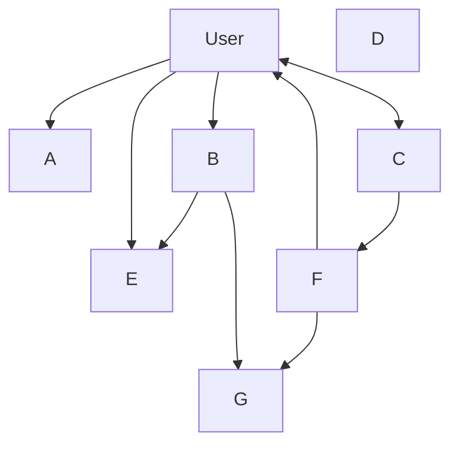
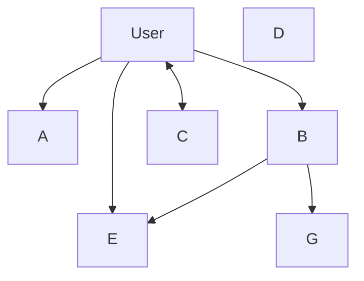

Les générateurs de traxion permettent via la paramétrisation de prisma certaine customization. Nous utilisons ce que nous appelons des métadata directement dans le schema prisma.

## Metadata

Une metadata traxion est un commentaire prisma commencant par trois `/`. La convention utilisé dans traxion est de namespacer ces metadata pour être sure de ne pas géner l'utilisation d'autre générateurs utilsant ce même systeme. Ainsi vous pouvez devant un modèle ou devant un field ajouter autant de métadata.

Toutes les metadata commencant par `/// @trxn/` seront interpretété par traxion. Le reste sera considéré comme de la documentation.

## User singularity

In every application one table is always a singularity, this is the User table. Traxion n'est pas exception et doit en son sein savoir quelle est le modèle qui porte l'information des utilisateurs.

Pour utiliser traxion sans configuration particulière il faut a minima respecter le model user minimal suivant:

```prisma
model User {
  id       String    @id @default(uuid())
  email    String @unique
  role     String @default("user")
  /// @trxn/hidden
  /// @trxn/encrypted
  password String
}
```

Nous verrons plus bas a quoi correspondent les différentes metadata utilisé ici.

Note: le field `id` ici est une string mais peut aussi est un Int: `id Int @id @default(autoincrement())`.

Note: le field `role` ici est une string mais peut aussi est un tableau de string `roles String[] @default(["user"])`.

## User discovery

Traxion essaye de découvrir sans configuration quel est le modèle dans votre schema de base de données quelle est la table portant les informations de votre utilisateurs.

Pour ce faire traxion regarde d'abord si un de vos modèle pour la metadata `user`. Si oui ce model sera utilisé comme modèle racine permettant d'explorer l'arbre d'ownership de votre schema. Si non traxion va essayer de trouver un modèle ayant le nom `user` ou `users` (la case n'importe pas). Si rien n'est trouvé certain generateur emetterons une erreur (casl).

```prisma
/// @trxn/user
model UserTable {
  //...
}

model User {
  // ...
}
```

Ici traxion utilisera la table `UserTable` comme table de user racine.

```prisma
model UserTable {
  //...
}

model User {
  // ...
}
```

Ici traxion utilisera automatiquement la table `User` comme table de user racine.

## Ownerships

Traxion will try to discover automatically the dependency tree of your datamodel starting with the user model. The tree will pass throught the model relation. From that we'll be able to detect direct and indirect owned model.

A owned model is a model related to the user table. In traxion if an entity is owned by a user, the user can read, create and update it else the user can only read it.

Note: You always will be able to use or not the generated casl configuration, to use it entirely, or partially at your convinence. Traxion will give you helpers and try to propose you a bunch of automatique casl configuration. But if you are not satifies with it you can opt out some functionallities to configure as you want.

You can tweek directly some configuration of the casl config with metadata on your models:

- `@trxn/ownership:ignore` Ignore the model and all its relations for the ownership detection

Taking this hypothetic schema prisma:

```prisma
model User {
  id       String @id @default(uuid())
  email    String @unique
  role     String @default("user")
  /// @trxn/hidden
  /// @trxn/encrypted
  password String

  f   F      @relation(fields: [fId], references: [id])
  fId String

  a A?
  b B[]
  c C[]
}

// One one relation
/// @trxn/permission: allowDelete
model A {
  id     String @id @default(uuid())
  user   User   @relation(fields: [userId], references: [id])
  userId String @unique
}

// One many relation
/// @trxn/permission: readOnly
model B {
  id String @id @default(uuid())

  user   User   @relation(fields: [userId], references: [id])
  userId String @unique

  e E[]
  g G[]
}

// Many many relation
model C {
  id   String @id @default(uuid())
  user User[]
  f    F[]
}

// No relation
model D {
  id String @id @default(uuid())
}

// Related to B
model E {
  id String @id @default(uuid())

  b   B      @relation(fields: [bId], references: [id])
  bId String
}

// Related to C
/// @trxn/ownership: ignore
model F {
  id String @id @default(uuid())

  c   C      @relation(fields: [cId], references: [id])
  cId String

  g    G[]
  user User[]
}

// Related to F
model G {
  id String @id @default(uuid())

  f   F      @relation(fields: [fId], references: [id])
  fId String

  b   B      @relation(fields: [bId], references: [id])
  bId String
}

// No relation
/// @trxn/permission: write
model H {
  id String @id @default(uuid())
}
```

Without the `/// @trxn/ownership: ignore` on the F model metadata the ownership graphql will be:



But traxion use the `/// @trxn/ownership: ignore` metadata to ignore the model from the graphql.
So the prisma schema graphql will actually be:



## Read, write, delete authorization

The ownership tree will be used to define the casl ids to fetch for each user and which configuration should be used by default when reading or writing on a owned or not owned model.

For example the prisma schema up there will output this user select ownerships ids:

```ts
export const UserSelectOwnershipIds = Prisma.validator<Prisma.UserArgs>()({
  select: {
    id: true,
    fId: true,
    a: {
      select: {
        id: true,
        userId: true,
      },
    },
    b: {
      select: {
        id: true,
        userId: true,
        e: {
          select: {
            id: true,
            bId: true,
          },
        },
        g: {
          select: {
            id: true,
            bId: true,
            fId: true,
          },
        },
      },
    },
    c: {
      select: {
        id: true,
      },
    },
  },
});
```

From that traxion will try to propose you a simple casl configuration:

```ts
export function userOwnershipPermission(
  abilities: AbilityBuilder<AppAbility>,
  user: UserWithOwnershipIds,
) {
  // User: the user own
  // -> default permission
  canReadActionsUser(abilities, user);
  // The user own the model, he can write on it
  canWriteActionsUser(abilities, user, false);

  // A: the user own
  // -> allowDelete permission
  canReadActionsA(abilities, user);
  canWriteActionsA(abilities, user, true);

  // B: the user own
  // -> readOnly permission
  canReadActionsB(abilities, user);
  // disabled cause of the read permission
  // canWriteActionsB(abilities, user, true);

  // C: the user own
  // -> default permission
  canReadActionsC(abilities, user);
  // The user own the model, he can write on it
  canWriteActionsC(abilities, user, false);

  // D: the user doesn't own
  // -> default permission
  canReadActionsD(abilities, user);
  // The user doesn't own the model, he can't write on it

  // E: the user own
  // -> default permission
  canReadActionsE(abilities, user);
  // The user own the model, he can write on it
  canWriteActionsE(abilities, user, false);

  // F: the user doesn't own
  // -> default permission
  canReadActionsF(abilities, user);
  // The user doesn't own the model, he can't write on it

  // G: the user own
  // -> default permission
  canReadActionsG(abilities, user);
  // The user own the model, he can write on it
  canWriteActionsG(abilities, user, false);

  // H: the user doesn't own
  // -> write permission
  canReadActionsH(abilities, user);
  canWriteActionsH(abilities, user, false);
}
```

In you schema you can add permission configuration to tell traxion how it must handle each model with the casl configuration:

- `@trxn/permission:allowDelete` the user can read, write and delete the model
- `@trxn/permission:write` the user can read and write the model
- `@trxn/permission:readonly` the user can read the model
- `@trxn/permission:internal` the user cannot read and write  the model

## Hidden

```prisma
model User {
  // ...

  /// @trxn/hidden
  password String

  // ...
}
```

The hidden metadata on a field allow you to hide from the output interface this data. The input will still ask for the field if it is required. This filter is done in the business layer.

## Encrypted

```prisma
model User {
  // ...

  /// @trxn/encrypted
  password String

  // ...
}
```

The encrypted metadata on a field allow you to encrypt the field (with bcrypt by default) during the update or create of the business layer.
