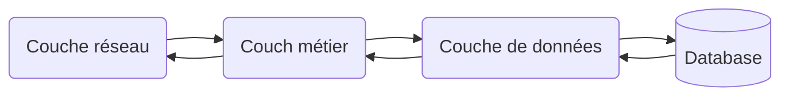
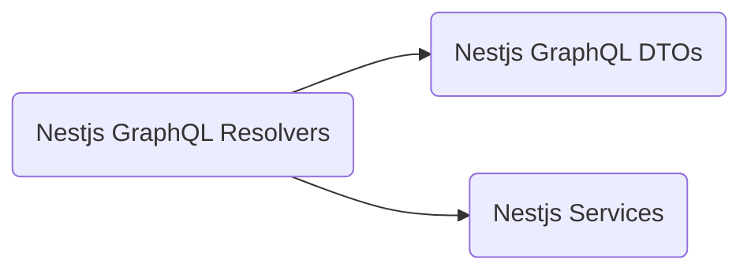
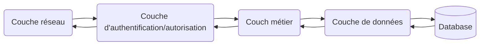
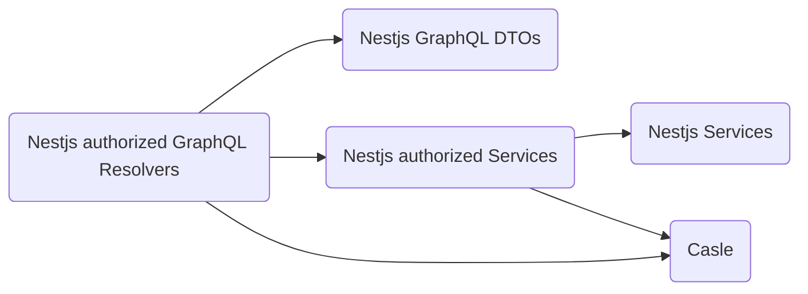

## Vue d'ensemble

### Api graphql publique

#### Conceptes

Le code de l'api graphql publique est organisé en 3 couches, ayant chacune un rôle bien défini:

- **La couche réseau** - Cette couche définit l'interface de l'api graphql, ainsi que la logique pour résoudre les requêtse. Elle est composée de:
  - **DTOs**: ils définissent le schéma graphql ainsi que la validation des données reçues en entrée de l'api. Plus concrètement, il s'agit de classes typescript annotées avec des décorateurs graphql pour la définition du schéma et des décorateurs class-validator pour la validation des données. Le générateur résponsable de la génération de cette couche est [prisma-nestjs-graphql](https://github.com/unlight/prisma-nestjs-graphql).
  - **Résolveurs**: ils définissent la logique pour résoudre les requêtes graphql, et délèguent le traitement à la couche métier.

- **La couche métier** - Cette couche définit la logique métier de l'api, et délègue ensuite la récupération des données à la couche suivante. La couche métier générée est par défaut plutot vide, et à plutot vocation à être étendue et enrichie avec du code custom. Elle est générée par le générateur [@trxn/prisma-nestjs-services-generator](https://github.com/tractr/traxion).

- **La couche de données** - Cette couche définit la logique d'accès aux données et consiste principaleremt en un client prisma wrappé pour être consomé dans un context nestjs. Elle est gérée par le même générateur que la couche précédent ([prisma-nestjs-graphql](https://github.com/unlight/prisma-nestjs-graphql))

#### Flow de données à travers les différentes couches



#### Graph de dépendances entre les différentes "librairies"



### Api graphql authentifiée

#### Conceptes

L'api GraphQL authentifiée est composée des mêmes couches que l'api graphql publique, auxquelles est ajoutée une couche responsable de l'authentification/autorisation. La partie authentification est implémentée avec [passport](http://www.passportjs.org/), et la partie autorisation avec [casl](https://casl.js.org/v5/en/).

Pour générer la couchea d'autorisation de l'api, 3 générateurs entrent en jeu:

- [@trxn/prisma-casl-generator](https://github.com/tractr/traxion/tree/main/libs/hapify/prisma/casl-generator) - Ce générateur génère toute une liste de droits et permissions pour chaque entitée de la modélisation, ainsi qu'une stratégie d'authorisation par défaut. Ces permission peuvent ensuite être composées pour définir une gestion de roles et autorisation plus complexe. Le générateur génere aussi une gestion de role par défaut qui devrait couvrir les cas les plus simples.

- [@trxn/prisma-nestjs-authorized-services-generator](https://github.com/tractr/traxion/tree/main/libs/hapify/prisma/nestjs-authorized-services-generator) - Ce générateur génère des services qui vont appliquer la gestion d'authorisations définie par le générateur précédent avant de déléguer le traitement des données à la couche métier.

- [@trxn/prisma-nestjs-authorized-graphql-resolvers-generator](https://github.com/tractr/traxion/tree/main/libs/hapify/prisma/nestjs-authorized-graphql-resolvers-generator) - Ce générateur vient enrichir les résolveurs générés pour l'api publique afin d'y ajouter les gardes et la logique d'authorisation.

#### Flow de données à travers les différentes couches



#### Graph de dépendances entre les différentes "librairies"



```bash
.
├── node_modules
├── package.json
├── tsconfig.app.json
├── tsconfig.json
|── tsconfig.spec.json
├── README.md
├── prisma
│   ├── schema.prisma
│   └── seed.ts
├── src
    ├── app
    │   ├── app.module.ts
    │   ├── config
    │   │   ├── authorization.config.ts
    │   │   └── index.ts
    │   ├── modules
    │   │   ├── authentication.module.ts
    │   │   ├── authorized-services.module.ts
    │   │   ├── database.module.ts
    │   │   ├── graphql.module.ts
    │   │   ├── index.ts
    │   │   ├── services.module.ts
    │   │   └── user.module.ts
    │   └── resolvers
    │       └── custom.resolver.ts
    ├── casl
    │   └── ...
    ├── nestjs-authorized-resolvers
    │   └── ...
    ├── nestjs-authorized-services
    │   └── ...
    ├── nestjs-graphql-dtos
    │   └── ...
    ├── nestjs-resolvers
    │   └── ...
    ├── nestjs-services
    │   └── ...
    └── main.ts
```
