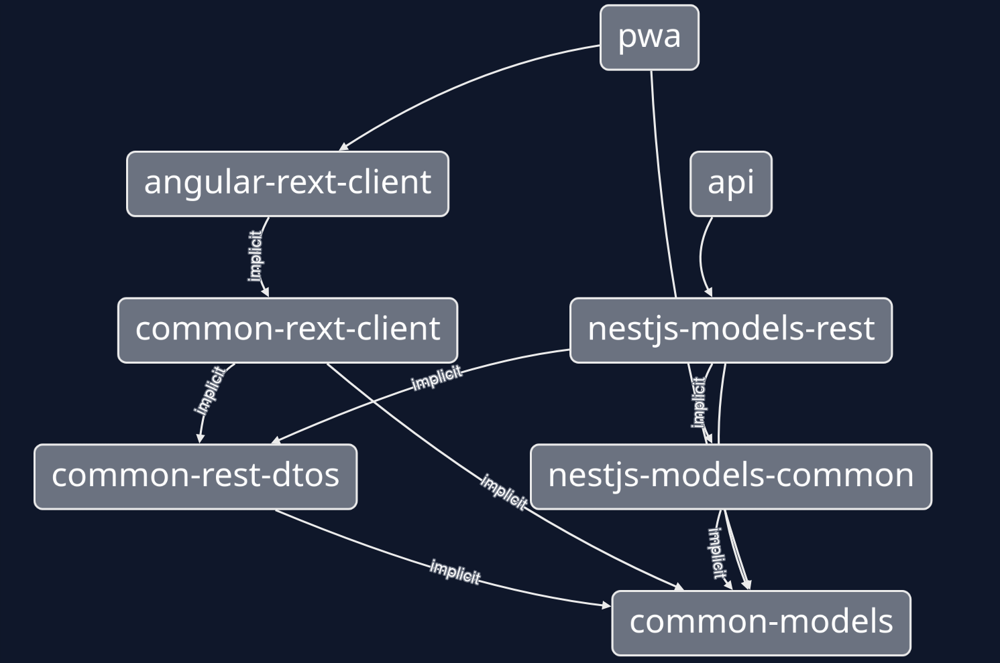

## Structure of the REST API libraries



The REST API is divided into several libraries that form 3 groups:

- `common`: the common libraries are pure TypeScript and are framework agnostic. They can be used either on the backend or on the frontend.
- `nestjs`: backend libraries related to the NestJS framework.
- `angular` : the frontend libraries related to the Angular framework.

Here are the libraries that make up the REST API:

- `common-models`: It defines the types and validators of the model objects returned by the API. It is used on the backend and the frontend to ensure the type safety of the API and the client.
- `common-rest-dtos`: It defines the types and validators of the parameters that can be used to call the API routes (search parameters, create and update operation body, etc.). It is used on the backend and frontend side to ensure type safety of the API and the client.
- `common-rext-client` : this library contains the typed client (SDK) of the API rest. It is agnostic and can be used on both the front-end and the back-end.
- `angular-rext-client`: this library provides an Angular wrapper around `common-rext-client` by adding the Angular dependency injection context. It exposes Angular services to call the REST API.
- `nestjs-models-common`: this library contains the NestJS services responsible for the business logic layer. These services are then used by the REST layer and the GraphQL layer. This is the place where the business logic must be added.
- `nestjs-models-rest`: this library contains the controllers and services for the REST API.

### Add new route

Let's consider an example: you want to add a route to the generated `UserController` to return the friends of a user. Before adding custom code, the file structure in the nestjs-models-rest library should look like this:

```text
libs/nestjs/models-rest
└── src
    ├── generated
    │   └── nestjs-models-rest
    │       └── src
    │           ├── ...
    │           └── user
    │               ├── controllers
    │               └── services
    ├── index.ts
```

Create a file to host your custom controller in `libs/nestjs/models-rest/src/user.controller.ts`. You need to declare a class that extends the generated controller, and add your custom method:

```typescript
import { UserController as GeneratedUserController } from './generated';
import { User } from '@scope/common-models';
import { UserGetFriendsDto } from '@scope/common-dtos';

export class UserController extends GeneratedUserController {

	// IMPORTANT NOTE: If the added route is less specific thant existing routes in the generated
	// controller, you must redeclare them or they'll be shadowed by the new route
	@Get('friends/specific')
	getUserFriendsSpecificRoute(@parmas() searchDto: UserGetFriendsDto): Promise<User[]> {
		super.getUserFriendsSpecificRoute(searchDto);
	}

	@Get('friends')
	getUserFriends(@parmas() searchDto: UserGetFriendsDto): Promise<User[]> {
		// here goes the custom code to handle the request
		// ...
	}
}
```

:::caution

The order of declaration of routes in a Nestjs controller is important: routes are evaluated in the same order as they are declared and the first route whose URL matches the URL of the request is executed. So, you have to declare the routes from the most specific to the most generic. In the same way, when a controller is extended and a route is added, the more specific routes must be redeclared so they are not overloaded by a more generic route.

:::

Once the new controller is added, the Nestjs module declaring the controllers must be updated to use the new `UserController` and not the generated one.

```typescript
// Before:
import { UserController } from './generated';

// After:
import { UserController } from './user.controller';

@Module({
	// ...
  controllers: [
    UserController,
    // ...
  ]
	// ...
})
export class NestjsModelsRestModule {}
```

Also, if the controllers are exported by the library via the `index.ts` file, you have to update the exports to publish the custom controller and not the generated controller.

```typescript
// Before:
export { UserController } from './generated';

// After:
export { UserController } from './user.controller';
```

### Adding the necessary DTOs and models

Adding a new route usually means adding new models and DTOs. In the case of the previous example, you would need to add `UserGetFriendsDto` to the `common-dtos` library and export it.

### Updating the `common-rext-client`

Once the new route has been added to the API, and the DTOs updated, it is possible to update the `common-rext-client` library, so that the new route can be easily used by the client, taking advantage of end-to-end typing.

The procedure to do this is similar to adding the new route on the backend. In the library, `common-rext-client`, we need to create a new service extending the generated service responsible for the resource we want to extend.

```text
libs/common/rext-client
└── src
    ├── generated
    │   └── rext-client
    │       └── services
    │           ├── user.service.ts
    │           └── ...
    ├── index.ts
    └── services
        ├── user.service.ts
        └── index.ts
```

```typescript
// file: libs/common/rext-client/src/sercives/user.service.ts
import { UserService as GeneratedUserService } from './generated';
import { User } from '@scope/common-models';
import { UserGetFriendsDto } from '@scope/common-dtos';

export class UserService extends GeneratedUserService {

	// Add the new custom method
  public findUserFriends$(
    findManyQuery?: UserGetFriendsDto,
    options?: FindManyOptions,
  ): Observable<User[]> {
    return fromDto(findManyQuery, UserGetFriendsDto).pipe(
      switchMap((params) =>
        findMany(this.apiUrl, { ...params }, options).pipe(
          extractAjaxResponseData(),
          transformAndValidateMap(User),
        ),
      ),
    );
  }
}
```

In order for the APi client to be correctly typed and benefit from the same validation as the API, the DTOs and models previously defined in `common-rest-dtos` and `common-models` are reused in the new function definition.

Once this is done, all that remains is to update the index to export the custom service instead of the generated service.

```typescript
// file: libs/common/rext-client/src/index.ts
// Before:
export { UserService } from './generated';

// After:
export { UserService } from './services/user.service';
```

### Update of the rext client for Angular

The `angular-rext-client` library extends the services generated in `common-rext-client` and adds the decorators required for Angular dependency injection.

In the case of adding a route in an existing service, there is nothing to do in this library.
