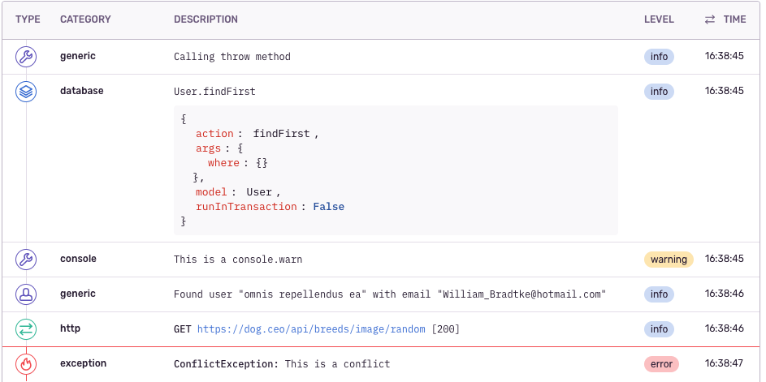

# NestJs Sentry

Provides a service to send log to Sentry and an interceptor to catch errors.

## Usage

### Add Sentry Module to your App

```typescript
@Module({
  imports: [
    SentryModule.register({
      dsn: 'https://public@sentry.example.com/1',
      debug: true,
      environment: 'production',
      release: API_VERSION ?? undefined,
      logLevel: 2,
    }),
  ],
})
export class AppModule {}
```

### Enqueue steps (breadcrumbs) during the request life cycle

```typescript
import { Controller, Get } from '@nestjs/common';
import { Public } from '@trxn/nestjs-core';
import { SentryPerRequestLogger } from '@trxn/nestjs-sentry';

@Controller(['sentry-tester'])
export class SentryTester {
  constructor(protected sentryPerRequestLogger: SentryPerRequestLogger) {}

  @Get('/sample')
  @Public()
  public async sample() {
    this.sentryPerRequestLogger.push('Calling sample method', 'debug');
    // ... More things
    this.sentryPerRequestLogger.push('Found 2 users in database', 'query');
    // ... More things
  }
}
```

### Add the interceptor to the App

```typescript
import { SentryAppInterceptorProvider } from '@trxn/nestjs-sentry';
import { RequestTimestampModule } from '@trxn/request-timestamp';

@Module({
  imports: [
    RequestTimestampModule,
    // ...
  ],
  providers: [SentryAppInterceptorProvider({})],
  exports: [],
})
export class AppModule {}
```

With this configuration, if an error occurred during the request, it will be
sent to Sentry with the attached breadcrumbs.

`RequestTimestampModule` is required to enhanced error reporting. More
information below.

## Advanced usage

### Filter errors that will be sent to Sentry

```typescript
import { SentryAppInterceptorProvider } from '@polo/nestjs-sentry';

@Module({
  imports: [
    // ...
  ],
  providers: [
    SentryAppInterceptorProvider({
      filters: [
        (error) => error instanceof HttpException && error.getStatus() >= 500,
      ],
    }),
  ],
  exports: [],
})
export class AppModule {}
```

### Use interceptor on specific controller

```typescript
import { SentryInterceptor } from '@trxn/nestjs-sentry';

@Controller(['sentry-tester'])
@UseInterceptors(
  SentryInterceptor({
    filters: [
      (error) => error instanceof HttpException && error.getStatus() >= 500,
    ],
  }),
)
export class SentryTester {
  // ...
}
```

### Send logs to Sentry outside a request context

You can use the global logger if you are not in a request context.

```typescript
import { Injectable } from '@nestjs/common';
import { SentryLogger } from '@trxn/nestjs-sentry';

@Injectable()
export class OtherService {
  constructor(protected sentryLogger: SentryLogger) {}

  public method() {
    this.sentryLogger.warn('This is a warning');
  }
}
```

### Send error manually

```typescript
import { Injectable } from '@nestjs/common';
import { SentryLogger } from '@trxn/nestjs-sentry';

@Injectable()
export class OtherService {
  constructor(protected sentryPerRequestLogger: SentryPerRequestLogger) {}

  public method() {
    try {
      // ....
    } catch (error) {
      this.sentryPerRequestLogger.handleError(e);
    }
  }
}
```

## Reporting

### Global and per request

This module uses 2 scopes for reporting: global and per-request.

For better logging and breadcrumb merging, use the per-request scope.

To send logs to the global scope, use service `SentryLogger`.

To send logs to the per-request scope, use service `SentryPerRequestLogger`.
Beware that all services using `SentryPerRequestLogger` will use the request
scope:

```typescript
@Injectable({ scope: Scope.REQUEST })
```

The interceptor `SentryInterceptor` uses the `SentryPerRequestLogger`.

### Default integrations

By default, Sentry add console logs and HTTP requests as `breadcrumbs` (in the
global scope). If an error occurs, these breadcrumbs are sent with the error
(along manually added breadcrumbs).

For more information about these default integrations:
https://docs.sentry.io/platforms/javascript/configuration/integrations/default/

### Global breadcrumbs

These default integration are not request scoped. Therefore, we do filter
breadcrumbs older than the request to separate signal from noise.

**Warning**

If two requests are concurrent, global breadcrumbs emitted by those requests
will be mixed.

To disable global breadcrumbs from per request reporting, use this option:
`pushGlobalBreadcrumbsWithPerRequestBreadcrumbs`.

### Request age

We need to determine the age of the request in order to filter global
breadcrumbs and associate them to the current request.

To determine the age of the request, we use the module `RequestTimestampModule`
from `@trxn/request-timestamp`. This module adds the request timestamp in
`req.res.locals.timestamp`.

If this module is not loaded, we assume the request is 2 seconds old. This age
can be configured with this option: `requestDefaultAge` (in milliseconds).

### Prisma middleware

This module adds a listener on Prisma queries:
https://www.prisma.io/docs/concepts/components/prisma-client/middleware

As long as we cannot access the request context in this middleware, queries are
pushed as breadcrumbs in the global scope. These breadcrumbs will then be
filtered using the request's age mechanism.

### Example

This controller:

```typescript
@Controller(['sentry-tester'])
@UseInterceptors(
  SentryInterceptor({
    filters: [
      (error) => error instanceof HttpException && error.getStatus() >= 500,
    ],
  }),
)
export class SentryTester {
  constructor(
    @Inject(USER_SERVICE)
    protected userService: UserService,
    protected httpService: HttpService,
    protected sentryPerRequestLogger: SentryPerRequestLogger,
  ) {}

  @Get('/throw')
  @Public()
  public async throw() {
    this.sentryPerRequestLogger.push('Calling throw method', 'debug');

    const user = await this.userService.findFirst({
      where: {},
    });

    console.warn('This is a console.warn');

    await new Promise((r) => setTimeout(r, 1000));

    if (user) {
      this.sentryPerRequestLogger.push(
        `Found user "${user.name}" with email "${user.email}"`,
        'user',
      );
    } else {
      this.sentryPerRequestLogger.push('No user found', 'user');
    }

    await this.httpService
      .request({
        method: 'GET',
        url: 'https://dog.ceo/api/breeds/image/random',
        headers: {
          'Content-type': 'application/json;charset=utf-8',
        },
      })
      .toPromise();

    await new Promise((resolve, reject) =>
      setTimeout(() => {
        reject(new ConflictException('This is a conflict'));
      }, 1000),
    );

    return 'ended';
  }
}
```

Will show this in Sentry:


